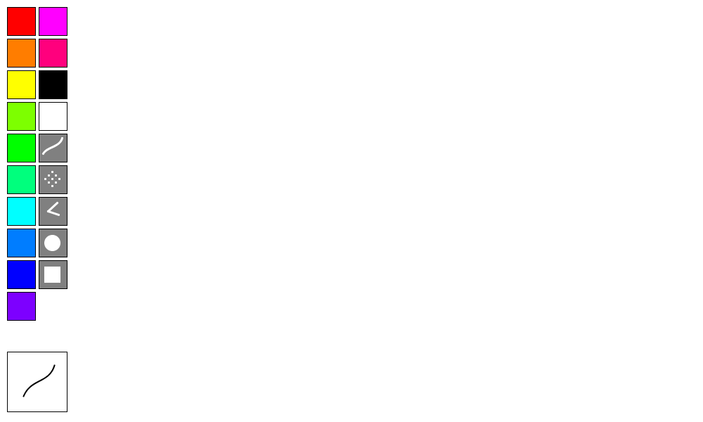
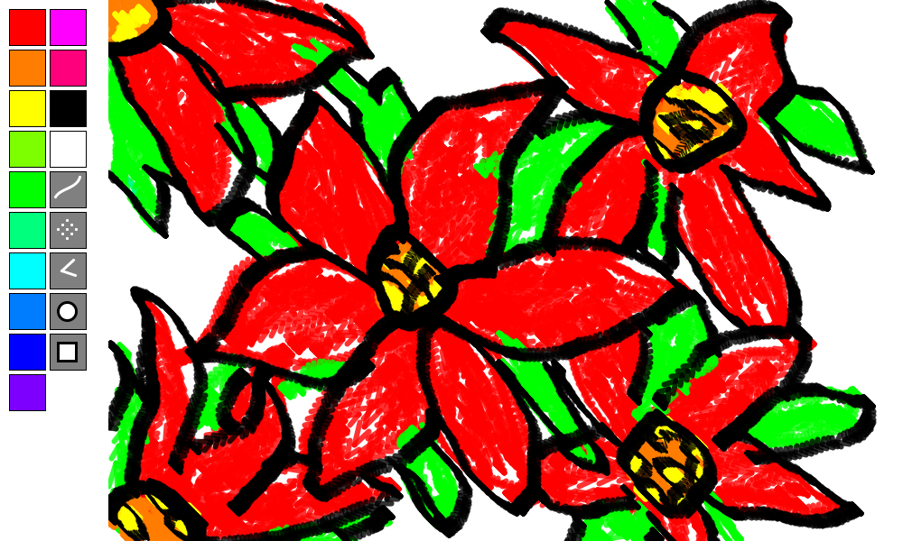
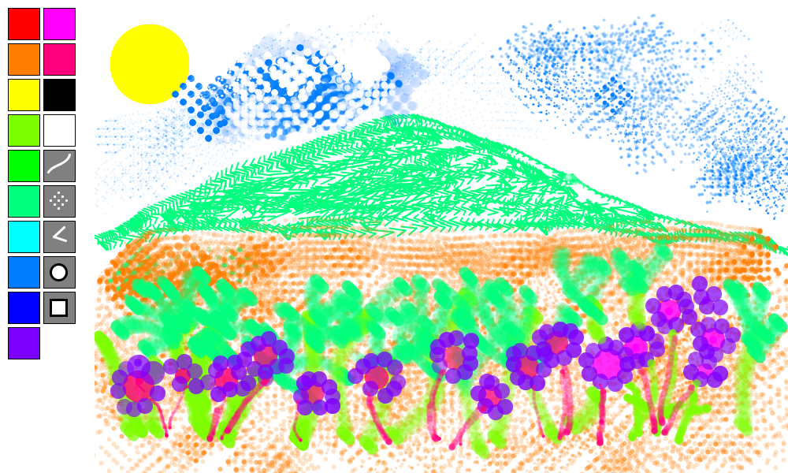

# Drawing Program

## GUI
The user is presented with a default white drawing area. The palette board on the left side contains
color and shape buttons to manipulate the brush settings. The initial brush settings are:

* color: black
* shape/type: pen
* opacity: 100% (completely opaque)
* weight/size: 2px

The bottom-left figure previews the current brush settings like color, stroke weight/size, opacity, and 
shape/type of the brush. It also shows whether the color randomizer is enabled or not.

  
  
## HOW TO DRAW
Draw by clicking and dragging the mouse pointer on the drawing area. To change the color or shape/type
of the brush, click any buttons on the palette board. To change the opacity press the LEFT (decrease)
or RIGHT (increase) arrow key. To change the stroke weight or size of the brush, press the UP (increase) or 
DOWN (decrease) arrow key. The user can manipulate the opacity or stroke weight/shape while drawing.

## CLEAR SCREEN
Clear the screen by pressing the 'c' key. To delete a part of the drawing, change the brush color to white (or
any color depending on the color of the background) and change brush shape/type as desired. 

## ENABLE COLOR RANDOMIZATION
To enable color randomization, press the 'r' key. This randomly changes the brush color while the brush
is being used. To disable it, press the 'r' key again. The brush color will revert to its previous color.

## ENABLE MIRRORING
To enable mirroring, press the 'm' key. This will create a mirrored version of the drawing as the brush is
used. To disable it, press the 'm' key again.

## SAVE DRAWING
To save the drawing as an image, press the 's' key. The program will produce the image file as a .PNG

## SAMPLE DRAWINGS

